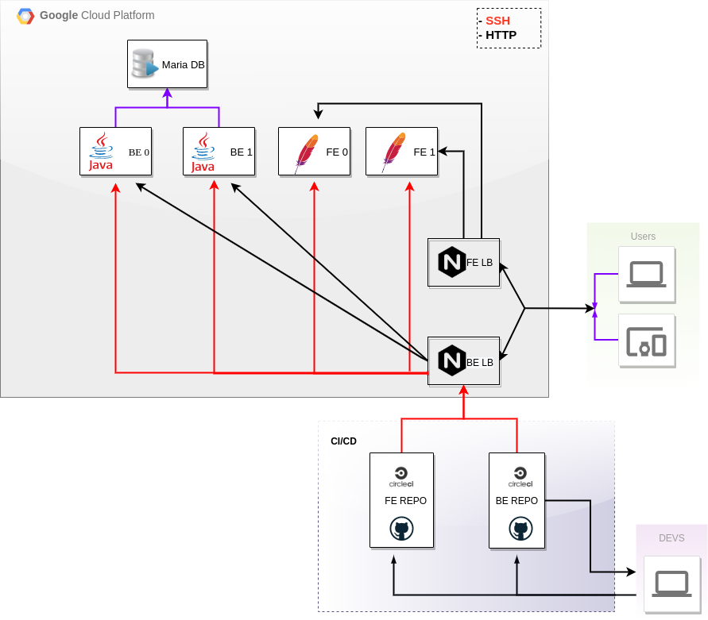

### Deploy Eschool



#### Before you begin:
- Install vagrant 2.2.9
    - [Download and install Vagrant](vagrantup.com/downloads.html)
- Install vagrant GCP plugin [Vagrant Google Compute Engine (GCE) Provider](https://github.com/mitchellh/vagrant-google)
    - ```bash vagrant plugin install vagrant-google ```
- Create GCP project, add keys:
    - [You can follow instruction here](https://github.com/mitchellh/vagrant-google) 
    - [Register external IP in GCP](https://console.cloud.google.com/networking/addresses/)

- Fork repositories ([front-end](https://github.com/meyson/final_project), [back-end](https://github.com/meyson/eSchool)) and add them to CircleCI
    - Create circleci token and place it in your credentials.yalm
    - Add ssh keys of lb_be to CircleCI
    - Add env variables SSH_HOST=(your external ip for lb_be), SSH_USER=(lb_be user)


#### Configuration:
    mv credentials_eschool_prod.yaml.sample ~/devops/creds/credentials_eschool_prod.yaml
    # read and configure files config.yaml, credentials_eschool_prod.yaml

#### Run application:

```bash
vagrant up
```
